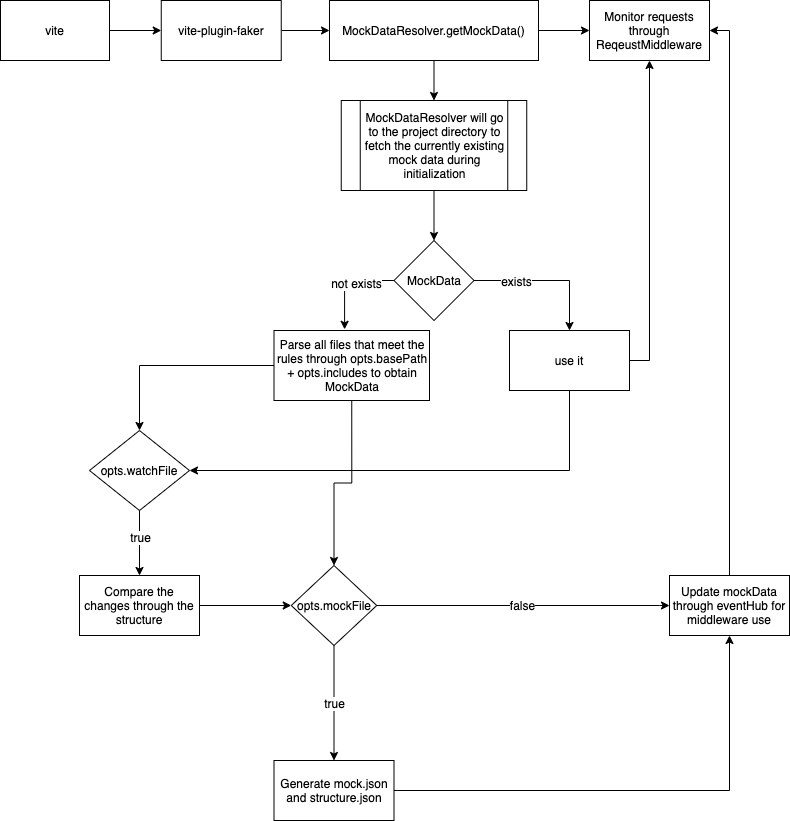

<h1 align="center">vite-plugin-faker</h1>

English | [简体中文](./README-zh_CN.md)

## ✨ Features

- 📦 Offline mock tool out of the box

- 😛 Define the return value through the interface Interface automatically generates mock data

- 📄 Support generating mock files for secondary editing

- 🔥 Support hot update, only update the changed part

## 📦 Installation

```bash
yarn add -D vite-plugin-faker
```

```bash
npm install vite-plugin-faker --save-dev
```

## 🔨 Example

Add configuration in `vite.config.ts`

```typescript
import vitePluginFaker from 'vite-plugin-faker';
import { defineConfig } from 'vite';

// https://vitejs.dev/config/
export default defineConfig({
  plugins: {
    vitePluginFaker({
      basePath: 'src/apis',
      mockDir: '/mock',
      includes: [/^.Service/],
      watchFile: true
    })
  }
});
```

Note: If you need to use this plugin to generate mock data, Please keep consistent with the requsest structure of the [playground](https://github.com/vue-toys/vite-plugin-faker/blob/main/playground/utils/Request.ts). Or the following two points are satisfied:

- GET or POST accepts a generic return value, the first parameter of the method is url

- GET or POST calls a general request method, the second parameter of the general request method is the general backend return body type

## ⚙️ Configuration items

-`basePath`: The root directory to be parsed, with the project directory as the root directory

-`includes`: The class name rules to be parsed, you can set a regular expression or an array of regular expressions

-`excludes` and `includes` are mutually exclusive, meaning type rules not to be parsed, generally not used

-`watchFile`: Whether to monitor file changes, when it is true, mock data will be automatically updated when the file changes

-`mockDir`: Set the mock file storage location. If it is not set, the mock file will not be generated, that is, it will be read from the memory every time

## 📛 Mock.json extra fields

You can customize your request in the generated mock.json

```json
{
  // Interface response time
  "timeout": 200,
  // The corresponding Http status code of the interface
  "httpCode": 401
}
```

## 📁 Workflow


